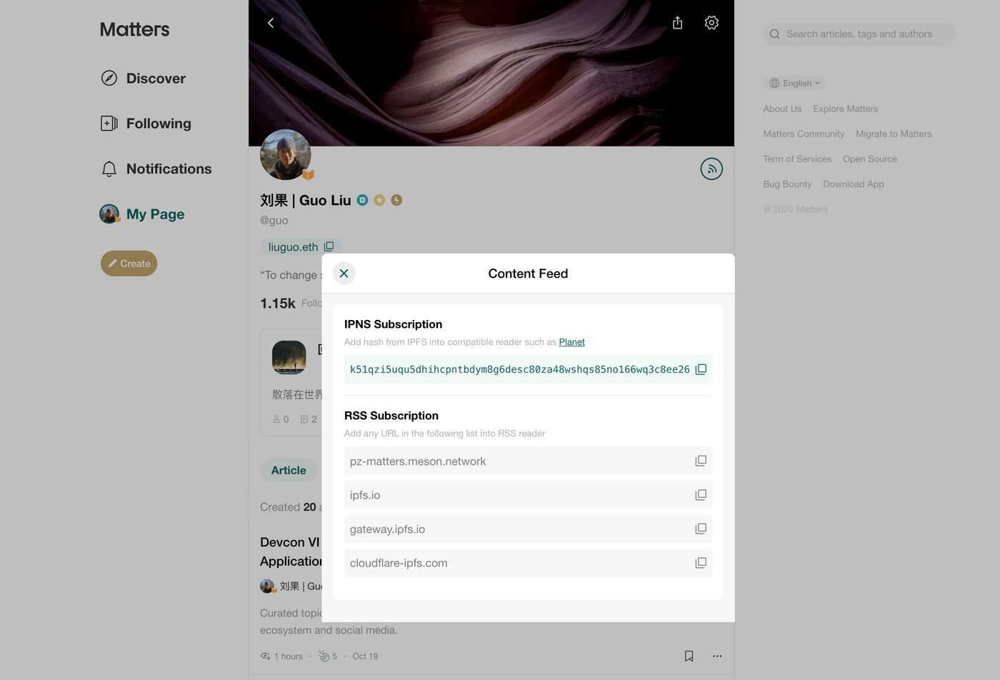
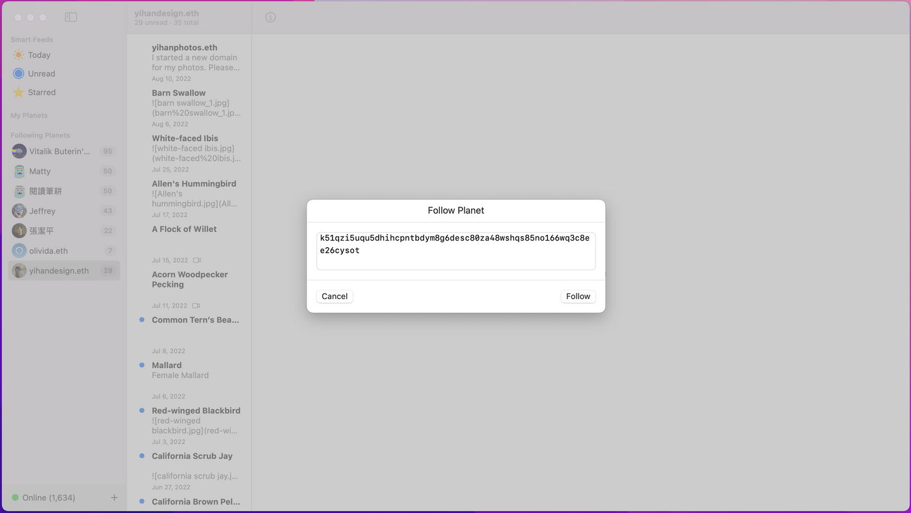
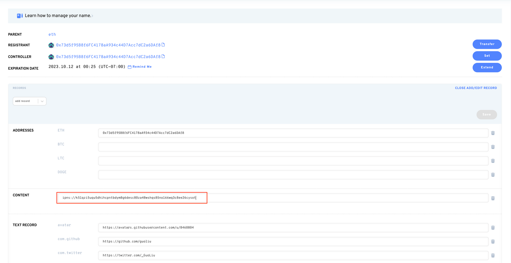
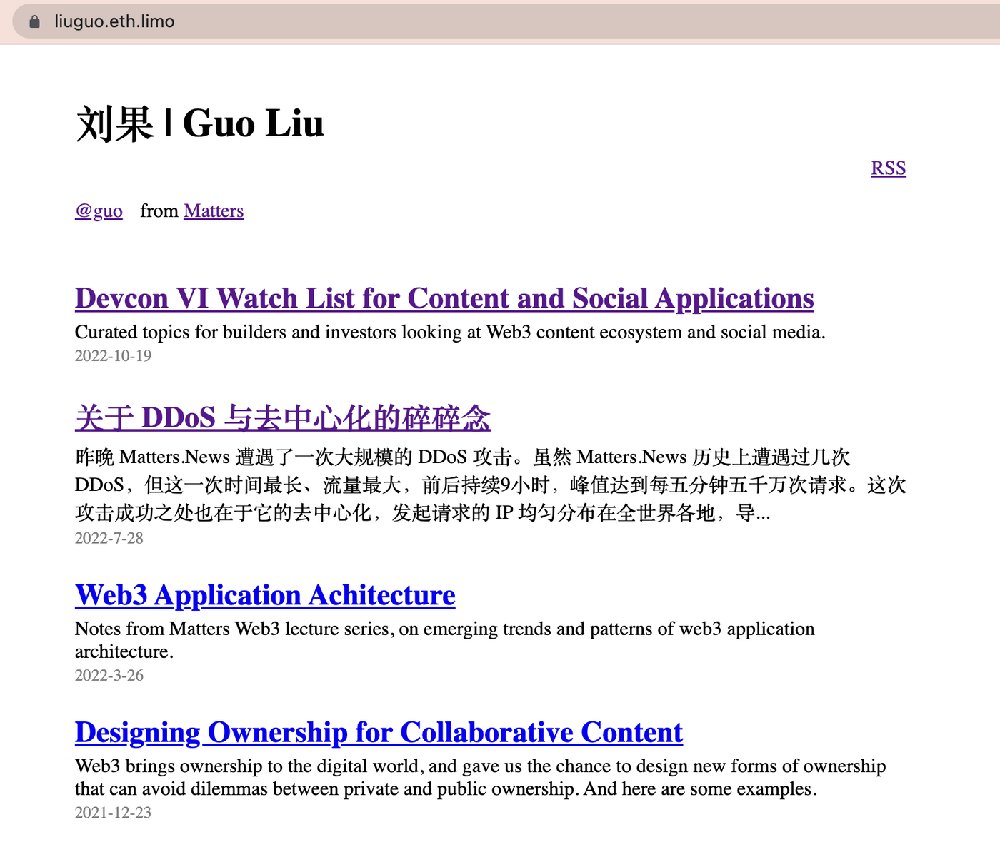

Matters 开始测试基于 IPNS 的 content feed，目前拥有 Traveloggers 的朋友可以提前试用。点击个人主页右边“信号”图标，会显示 Content Feed 弹窗，绿色部分即是 IPNS hash。

*Matters.News 个人主页中的 IPNS hash*

[IPNS](https://docs.ipfs.tech/concepts/ipns/) 是 IPFS 设计中用于处理动态数据的部分。用 IPNS hash 指向主页和内容，让用户能够不断更新和增减内容，同时内容指纹保持不变。

实现的方式是，每个用户有一对密钥，每次发布时通过密钥签署、证明内容的真实性。目前密钥存在 Matters 的数据库中，由 Matters 服务器代为签署。

配合 [Planet](https://www.planetable.xyz/)，用户可以通过 IPNS hash 来点对点传输数据，不再需要经过 Matters 的服务器，也不再依赖互联网的域名系统。

除此之外，IPNS hash 可以用来做什么？

## 1. 为珍视的内容进行备份

Matters 上的内容存储在 IPFS 上，让内容更难以被删除和封锁，但无法保证“永久存储”，因为依然依赖 Matters 提供的 IPFS node pin 数据。

最理想的让内容免于丢失和封锁的存储方式，是使用者各自在本地存一份。Planet 的订阅功能正是这么实现的，订阅者同时在本地存储了订阅的内容，并在后续协助内容以点对点的形式分发。

下载 Planet 后，点击左下角“+”，并选择“Follow Planet”，输入个人主页中得到的 IPNS 指纹，便可以点对点订阅内容，同时为内容进行备份。

*Planet 中通过 IPNS hash 点对点订阅与备份内容*

## 2. 为自己的 ENS 配置个人页面

Matters 提供的 IPNS hash 中不仅存有用户发布的内容，还存有一个简单的静态个人主页。在任意一个支持 IPNS 的 IPFS 公共网关中直接打开 IPNS hash，就可以看到这个个人主页。比如，这是我的 IPNS hash 在 ipfs.io 网关中的路径：


```
https://ipfs.io/ipns/k51qzi5uqu5dhihcpntbdym8g6desc80za48wshqs85no166wq3c8ee26cysotda
```

IPNS 也是 ENS 支持的标准，意味着用户可以通过 [EIP-1577 标准](https://eips.ethereum.org/EIPS/eip-1577)将这个静态页面设为自己在 Web3 中完全分布式分发的个人主页。

进入 [ENS 管理界面](https://app.ens.domains/)，选择想要使用的域名，点击“add/edit record”，并在“content”一栏填入“ipns://”加上 Matters 生成的 IPNS hash。最后点击 save，在钱包上确认并支付 gas fee。

*app.ens.domains 中将 IPNS hash 设为 ENS 的 content hash*

几分钟后，就可以通过 eth.link、eth.limo 等服务或者 Brave 浏览器等支持 ENS 的客户端访问自己在 ENS 上的个人主页了。Planet 用户可以通过 liuguo.eth 订阅我的内容，而这是我的 ENS 域名通过 eth.limo 访问的结果：

*配置好的 ENS 个人主页*

未来已来，我们让它均匀分布。Enjoy!

