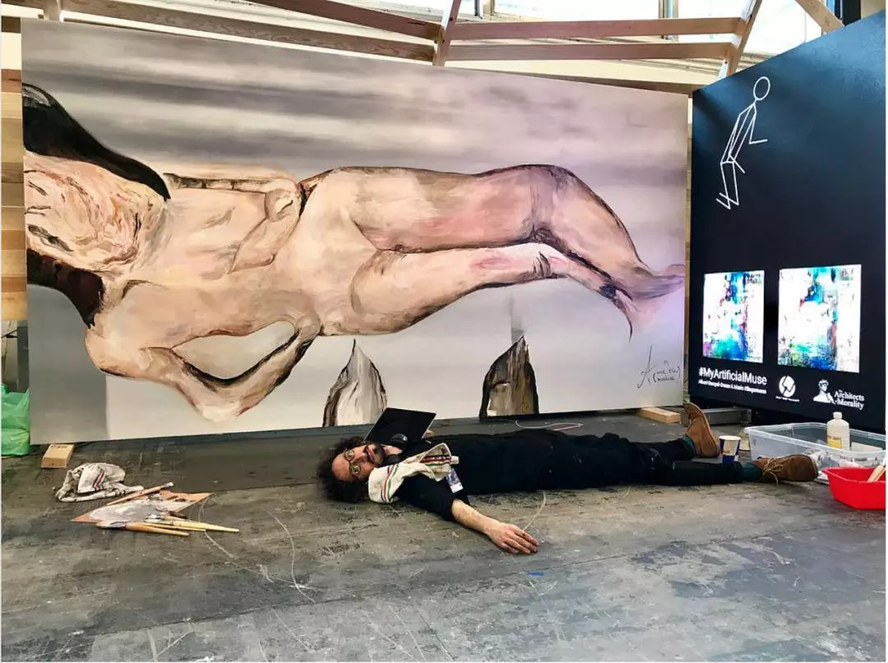
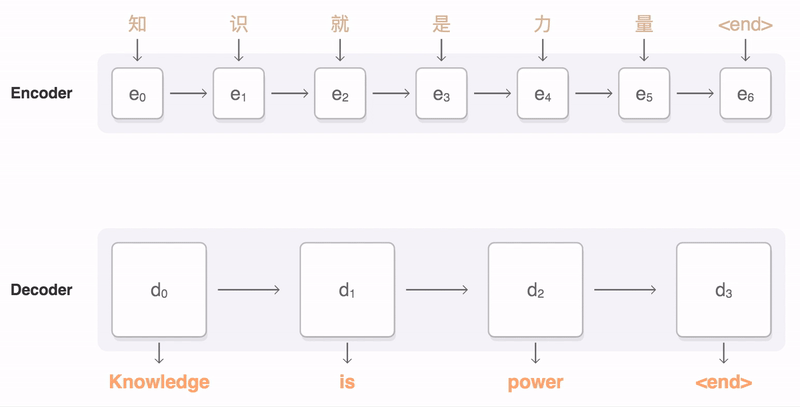

## 1

瑞士人工智能專家 Jurgen Schmidhuber 一次演講中說，我們不該把自己和飛速發展的人工智能看做“我們”和“他們”，而該把自己和人性當做宇宙通往更高復雜度路上的墊腳石。

在這充滿超人哲學意味的言論背後，Schmidhuber 有自己的一套理論。

笛卡爾說“我思故我在”，人類向來為自身獨一無二的思考能力而自豪。Schmidhuber 則認為，“理解”和“創造”這樣的思考過程，實質上是信息的壓縮。美感和幽默，則都是不同的信息壓縮方式，機器同樣能夠掌握。不僅如此，算法還可以自我進化，不斷依據外界信息優化自己，逐漸超越人類。

這種不斷迭代、進化自我的算法屬於一類被稱作“種子 AI”（Seed AI）的構架，它的實現意味著強人工智能的誕生。人工智能研究者們對於強人工智能是否能夠出現有所爭議，但是都認為它標志著機器在智能上全面超過人類。

Schmidhuber 是個堅定的奇點論者，相信技術的指數增長會讓人類社會在短期內發生生產方式的巨變。這些想法也並非他獨有，不少奇點論者同樣認為，人類只是智能進化中的一步。人們歷來熱衷於探索世界，而人工智能也只是這種無止盡探索的自然延展。

這種無止盡的探索，也在藝術創作中催生了日新月異的表達方式。人性與機械性交匯的典型，也許正是融入了技術的藝術創作。

例如Anna Ridler，期望將視覺與聽覺的表達相互關聯，擴展人表達的能力。於是她用自己多年的繪畫作品訓練了一個人工智能模型，讓它能夠分析和歸類自己的一筆一式。然後與作曲家合作，為各種繪畫方式編配不同女高音聲音樣本。最後，Ridler 利用眼鏡上的攝像頭獲取筆式信息，讓筆觸藉由人工智能同時生成繪畫與音樂。

*Anna Ridler，畫出聲音（Drawing with Sound），2017*

Mario Klingemann 則嘗試讓機器學習模型自己進行“表達”，生成“藝術品”。他將生成對抗網絡（Generative Adversarial Networks，GANs）應用到從文藝復興時期的畫作到 21 世紀的自拍照片等各種圖像上，學習畫作與照片中的構圖、顏色、形態與審美，並自己生成新的創作。

*Mario Klingemann，AI生成肖像，2017。图片来源：Wired*

Klingemann 的圖畫由算法產生，觀眾可以質疑這是否算是真的作品。而 Klingemann 的朋友 Albert Barque-Duran 則基於 Klingemann 生成的圖像重新創作繪畫，避免了這個問題，順便玩笑似地挑戰了藝術品中藝術性的定義。

*Albert Barque-Duran 躺在自己的畫作面前。 圖片來源：Albert Barque-Duran 推特賬號*

## 2

在創作者手中，人工智能不再是簡單的工具，而是可以以不同方式參與創造的智能，成為創作者智力的延展。在未來，人工智能將滲入生活的各個環節，我們需要與這種智能共存。但是這種智能，和我們自己的非常不同，並且讓人難以理解。

回溯到八十年代，人工智能領域流行的是一種稱為“專家系統”的構架，依賴於邏輯推理與數據化的知識庫。這種系統是對人類已有知識和思維模式的模仿，符合對“智能”的直觀認識，卻在簡單的認知任務面前一籌莫展。

真正讓人工智能在應用上突飛猛進的，是與人類思維方式關系不大的機器學習模型。這些模型是一個個充滿旋鈕的黑箱，每個旋鈕將接收信號轉換成輸出信號。優化不斷地調整這些旋鈕，直到整個黑箱能夠將收到的信息轉換為正確的輸出信息。

但是，使用者無法知曉每一個旋鈕旋轉的原因，也無法理解黑箱如何做出決定。

*Schmidhuber等人設計的LSTM（Long-Short Term Memory）模型是一種特殊的神經網絡，被廣泛用於自然語言識別，同樣是一個充滿旋鈕的黑箱。區別於傳統的神經網絡，LSTM可以根據輸入形成“記憶”，輸出收到輸入的次序影響。這使得LSTM得以將輸入的序列轉換為輸出序列，適合處理語言、音樂或其他序列數據。*

許多人會覺得，以這種方式運作的機器學習模型還算不上智能。但是， 鳥類雖不同於飛機，卻同樣具有飛行的能力。人們曾從鳥類得來飛行的靈感，試圖制造扇翅飛行的機械鳥，卻一直沒有獲得成功。只有放棄了對鳥類的模仿之後，才造出了現代意義上的飛機。

*在萊特兄弟發明現代意義上的飛機以前，許多人曾試圖模仿鳥類來制造飛行器。上圖是達芬奇 15 世紀時對鳥類飛行的研究和對飛行器的設計，下圖是 1884 年德國航空先驅奧托·李林塔爾制作的飛行器。圖片來源：維基百科。*

人工智能的研究也正是放棄了對人類意識的模仿，才產生出了能夠解決實際問題的機器學習模型。這種“智能”即使不同於我們，卻同樣能夠解決問題、進行創造，成為與我們類似而不同的“智能”。

## 3

這種類似與不同，在 Nao Tokui 的一個 DJ 表演中被展現得淋漓盡致。

在這個表演中，學習了無數音樂樣本的人工智能擔任 DJ，與 Tokui 合作一起打碟，人工智能會根據上一首曲子的風格選擇下一首音樂，並調整碟機轉動速度來匹配之前的音調音高。人工智能的選擇有時候讓 Tokui 感覺驚喜，如同 Klingemann 痴迷於 AI 在幾千張生成圖片中有時會繪制出來獨特的效果一樣，這種不可預期不可控的部分產生了新的靈感與創造力。

*Nao Tokui，AI DJ*

創造的能力無疑是通向更高“智能”的一步。物理學家費曼曾說，“我不能創造的，便不能理解”。學會了創造的人工智能，是否也擁有了某種形式的理解呢？

Klingemann 用於生成圖像的 GANs 模型，正是利用“創造”來教會模型“理解”。GANs 由兩個神經網絡組成，一個神經網絡負責生成以假亂真的圖片，另一個神經網絡則負責判別圖片的真假。兩個網絡在相互對抗中進行訓練，最終使整個模型同時獲得了生成逼真圖片和判別圖片真假的能力。

*從 2014 年到 2017 年，GANs 模型生成以假亂真圖像的能力突飛猛進。圖片來源：The Malicious Use of Artificial Intelligence: Forecasting, Prevention, and Mitigation, 2018*

技術是雙刃劍，能力強大如此的人工智能，必定兩邊都是利刃。

比如，人工智能與數字化制造的發展，實現了自動化生產的巨大潛力，同時也取代大量崗位。樂觀的展望中，更高的生產力使得社會朝高福利方向轉型，甚至進入某種社會主義社會。普通人得以從重復勞作中解放，得以從事創造性活動。

然而更可能的是，財富的積累快過財富的分配，技能的更新快過教育的改良。社會與政府轉型的速度跟不上技術的進步，最終導致大規模的失業和動蕩。

同時，人工智能也會直接帶來對人類的威脅。在埃隆 - 馬斯克（Elon Musk）和霍金等人簽署公開信督促人們關心人工智能的安全問題之後，許多人工智能從業者則一同起草了報告，論述人工智能潛在的威脅。

人工智能可以自動化並優化信息攻擊，擴大攻擊規模。手機、無人機、自動駕駛汽車等聯網機器普及之後，信息攻擊則可以超出電子和經濟系統，造成物理世界的直接傷害。

而人工智能與社交網絡的結合，則已經以意想不到的方式改變著輿論與政治。在社交網絡中，我們每個人都是一個節點，接受並傳播著信息。人工智能可以分析網絡傳播結構，確認影響輿論的重要節點，控制者得以進而引導輿論。

同時，人工智能可以模仿人類，生成虛擬水軍，直接改變輿論演變方向。這些技巧已經開始被廣泛使用，不管是公司用於營銷，還是政府對內和對外進行輿論導向。

不光可以偽造用戶，人工智能還可以偽造證據。借助 GANs、LSTM 等模型生成的聲音、圖像和視頻已經能夠以假亂真，產生難以辨別的假新聞。然而，無論從技術層面還是法律層面，都沒有好的解決辦法。

*人工智能偽造視頻的能力，既可以用來給成人錄像安上女明星的臉（上圖），也可以用來給政治人物安上希特勒的胡子（下圖），而人眼完全無法分辨真假。圖片來源：Motherboard*

## 4

人工智能正逐步理解我們的言論、行為和想法，我們也可以同樣去理解人工智能。但是，理解一門復雜的技術，則需要許多背景知識，特別是人工智能這樣涉及許多不同學科的領域。

將技術的權力交還給普通人，意味著降低技術的門檻。但是，在傳統的教育體系下，積累這些背景知識需要完成從小學到專業研究生階段的學習。

在技術的不斷發展面前，傳統教育方式即使能夠即時更新知識，也僅能保證學生記住枯燥的知識點，無法讓學生反思和探索相關的社會問題，也無法為快速變遷的社會結構做出准備。

而新媒體藝術正好能提供了探索式學習技術的機會。例如，許多國家的不同團體，逐漸開始將數字藝術創作常用的 Processing 和 p5.js 等工具融入中小學生的計算機教育中，讓編程不僅僅是枯燥的邏輯推演，也讓孩子們保留了自然的創造力。同時。信息收集和自我表達能力的加強，彌補了技術培訓中缺失的反思與探索，也使更多人可以參與對技術的討論和使用。

對於觀者而言，這些新興的藝術形式，不僅能讓我們以不同的視角認知和審視藝術，也能讓我們重新認識自己，和自身所處的這個處處聯通的世界。這種聯通的網絡讓我們的行為相互影響，但是在個體層面，卻很難理解這種網絡的結構和功能，不管是一個話題在社交網絡中的擴散，還是一個小商品遍布各地的原料和銷售網絡。

*Jer Thorp 等人通過可視化推特（Twitter）的數據，展示了一個話題在社交網絡中如何出現、擴散、放大，以及這些網絡中不同角色的用戶如何影響話題的生長於演變。圖片來源：New York Times Lab, Cascade項目*

*Owen Cornec等人通過可視化國家之間進出口的商品種類和數量，展示了不同的國家如何相互交互和依存，形成全球貨物流通的網絡。圖片來源：Harvard CID*

算法與美感的結合，也許能夠觸發新的審美，從另一種方式理解機械，也讓我們更習慣逐漸機械化的世界。冷冰冰的算法看上去與充滿情緒的藝術品相去甚遠，然而從 17 世紀的巴赫到 20 世紀的約翰·凱奇都利用算法與規則來創作動人心弦的作品。Memo Akten 的作品 Simple Harmonic Motion 則將兩者的衝突與融合展露無遺，模擬的擺錘以規律的方式運動，通過簡單的規則組合出古典音樂般的豐厚與動人。

*Memo Akten, simple harmonic motion-9*

盡管人工智能帶來的自動化勢不可擋，隨之而來的道德和社會問題也會一步步展開，但這些把技術與藝術相融合的努力可能是希望之一。不管未來如何不確定，技術的發展和知識的流通至少會讓人與人之間的機會與選擇更加平等。而藝術化的技術會喚起更多人對技術的關注和思考，並且將技術教育帶到不同的領域。這也許是機械化未來諸多挑戰中的一絲光亮。

---

原載於[視角雜誌](http://perspiceremagazine.org/generated-art.html)

